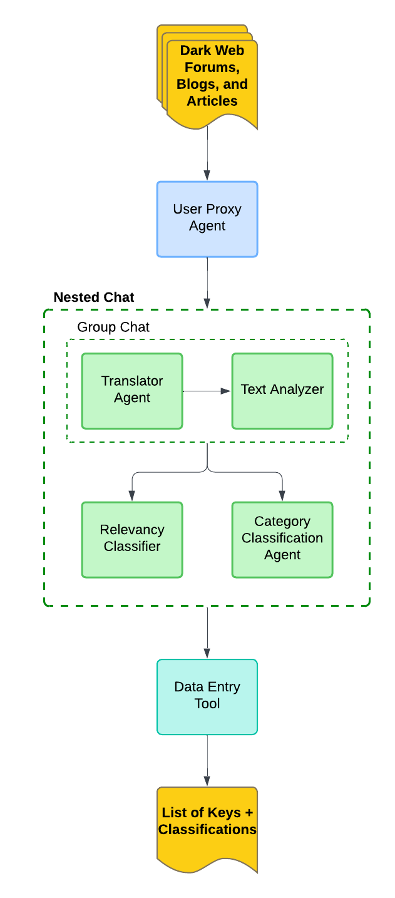

# MAD-CTI: Multi-Agent Dark Web Cyber Threat Intelligence

This repository is the official code implementation for the published paper [_MAD-CTI: Cyber Threat Intelligence Analysis of the Dark Web Using a Multi-Agent Framework_](https://ieeexplore.ieee.org/document/10908603) by Sayuj Shah and Vijay Madisetti.

## Quickstart

### Requirements

To install requirements:

```setup
pip install -r requirements.txt
```

### Replicating MAD-CTI Experiment

We have included all files used during experiment implementation. To replicate our results, you will need to request access to the [CoDA](https://huggingface.co/datasets/s2w-ai/CoDA) database. From there, set your .env variables with your OpenAI and HuggingFace API tokens. Finally, simply execute
```
python MAD_CTI_CoDA.py
```
### Using MAD-CTI With Web Scraper

To use the MAD-CTI tool with a dark web scraper, ensure [Tor](https://www.torproject.org/) is properly isntalled on your device and the SocksPort is configured as detailed in the [requests-tor documentation](https://pypi.org/project/requests-tor/). Once this is complete, set your .env variables with you OpenAI and HuggingFace API tokens, along with your torrc hashed control password and run:
```
python MAD_CTI.py
```

## Workflow Architecture

The basic architecture of the multi-agent workflow can be found below. MAD-CTI utilized [Microsoft AutoGen](https://www.microsoft.com/en-us/research/project/autogen/) to develop numerous agents the communicate with one another to complete tasks with little-to-no human intervention.


## Citing

If you make use of MAD-CTI in your work, please cite the following paper:

```
@ARTICLE{10908603,
  author={Shah, Sayuj and Madisetti, Vijay K.},
  journal={IEEE Access}, 
  title={MAD-CTI: Cyber Threat Intelligence Analysis of the Dark Web Using a Multi-Agent Framework}, 
  year={2025},
  volume={13},
  number={},
  pages={40158-40168},
  keywords={Dark Web;Cyber threat intelligence;Malware;Translation;Oral communication;Computer hacking;Blogs;Accuracy;Large language models;Computer architecture;Cybersecurity defense;cyber threat intelligence;dark web;hack;large language models (LLMs);malware;multi-agent systems (MAS);predictive intelligence;vulnerability},
  doi={10.1109/ACCESS.2025.3547172}}
```

## Contributors

- Sayuj Shah
- Vijay Madisetti

## Acknowledgements

This work was supported by the School of Cybersecurity and Privacy and the College of Computing at Georgia Institute of Technology.